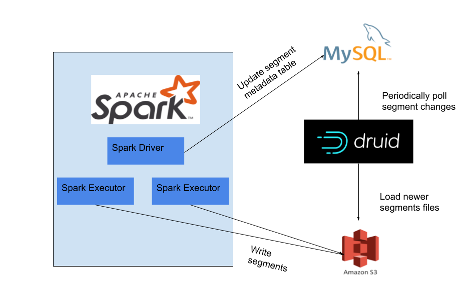

# rovio-ingest

An implementation of the DatasourceV2 interface of [Apache Spark™](http://spark.apache.org/) for writing Spark Datasets to [Apache Druid™](https://druid.apache.org/).

For example, this allows reading an [Apache Hive™](https://hive.apache.org/) table and ingesting it to Druid in a single Spark job.

### Contents

- [Overview](#overview)
- [Software requirements](#software-requirements)
- [Motivation](#motivation)
- [Dataset extension](#dataset-extension)
- [Data type conversions](#data-type-conversions)
- [Segment granularity](#segment-granularity)
- [Usage](#usage)
  - [No-Code wrapper script](#no-code-wrapper-script)
  - [PySpark](#pyspark)
  - [Scala](#scala)
  - [Java](#java)
  - [Write options](#write-options)
- [Limitations](#limitations)
- [Development](#development)
- [Building](#building)
- [Troubleshooting](#troubleshooting)

## Overview

Overview diagram:



* Apache Druid segments are written out to Deep Storage from Apache Spark executors
* Apache Spark driver updates the Apache Druid segment metadata table after all Apache Spark executors have completed.
* Old overshadowed segments are left in place so that Apache Druid process can properly replace them with newer segments (uses locking).

## Software requirements

rovio-ingest requires
* Apache Spark 3* 
* JDK8 (8u92+ or later).
* Linux or MacOS.
* Git repo must be cloned under a path that doesn't have spaces.

*) Spark 2 is not supported, but feel free to create a Github issue if you would need that.

## Motivation

The Druid StorageHandler of Hive is broken in AWS EMR. For example, AWS emr-5.29.0 uses Apache Hive 2.3.4 and it requires additional jar patching to make the Druid StorageHandler work.
Even then only CTAS is supported, which means that incremental updates are not possible. Further, it is not possible to create these Apache Hive tables from Apache Spark as they are created with StorageHandlers.
Hive 3 might bring some improvement, but the Druid StorageHandler doesn't work AWS emr-6.2.0 either, even though it has Hive 3.

To summarize, these are the features that `rovio-ingest` addresses, that are lacking with Hive-Druid integration:
* Treat `__time` column as partition dimension
* Support for `insert overwrite` with Apache Hive backed Apache Druid table (for Hive version < 3.0)
* Flexibility to use latest Apache Druid libraries.
* Update Apache Druid segments in transaction, leveraging Apache Druid's segment locking mechanism.

## Dataset extension

The Dataset extension performs the following validations:
* Type of `time_column` is `Date` or `Timestamp`
* The Dataset has one or more metric columns if rollup is enabled
* The Dataset has one or more dimension columns
* The Dataset has no columns with unknown types, unless `excludeColumnsWithUnknownTypes` is set to true

The Dataset extension performs the following transformations:
* Drops all columns of complex datatypes such as `StructType`, `MapType` or `ArrayType` as they
are not supported by `DruidSource`. This is only done if `excludeColumnsWithUnknownTypes` is set to true, otherwise validation has already failed.
* Converts `Date`/`Timestamp` type columns to `String`, except for the `time_column`
    - See [Druid Docs / Data types](https://druid.apache.org/docs/latest/querying/sql.html#standard-types)
* Adds a new column `__PARTITION_TIME__` whose value is based on `time_column` column and the given [segment granularity](#segment-granularity)
(applies
[NormalizeTimeColumnUDF](src/main/java/com/rovio/ingest/util/NormalizeTimeColumnUDF.java))
* Adds a new column `__PARTITION_NUM__` to denote partition shard which is
`(row_number() - 1) / rows_per_segment` for each partition
* Partitions the dataset with columns `__PARTITION_TIME__` & `__PARTITION_NUM__`

So it returns a newly partitioned Dataset with columns `__PARTITION_TIME__` & `__PARTITION_NUM__`
added. `__PARTITION_TIME__` & `__PARTITION_NUM__` columns are always excluded from segment metrics.

## Data type conversions

The following type conversions are done on ingestion:
- `Float` is converted to `Double`
    - See [Druid Docs / Double Column storage](https://druid.apache.org/docs/latest/configuration/index.html#double-column-storage))
- `Boolean` is converted to `String`

## Segment granularity

For example, when the input `__time` is `2019-01-02`: 

- if granularity = `DAY`, then time interval = `2019-01-02/2019-01-03`
- if granularity = `MONTH`, then time interval = `2019-01-01/2019-02-01`
- if granularity = `YEAR`, then time interval = `2019-01-01/2020-01-01`

The `com.rovio.ingest.DruidSource` expects that only one task writes out segments for a given
time interval and granularity. This is so that the task correctly shards DataSegments into requisite
partitions based on segment size configuration. It is the responsibility of Spark program to
correctly partition the dataset based on time interval first, which is handled by the provided
Dataset extensions of `rovio-ingest`.

## Usage

Code snippets for different languages are provided below.

The main steps are always the same:
1. The provided Dataset extension is first used to validate and repartition a Dataset so that it
satisfies the requirements of `DruidSource`
1. Then the Dataset can be written with the `DruidSource` format

### No-Code wrapper script

An example of a No-Code solution: [A general-purpose pyspark script for ingesting a Hive table to Druid](https://gist.github.com/vivek-balakrishnan-rovio/d7ac058d7a70cccf5f4165e8aeed9e9c), that enables users to avoid writing any Spark code.

In the basic case with this script user only needs to pass the source table name.

The script also offers some optional arguments for convenience, for example to customize the target types of columns. This kind of driver script is also a natural place for providing common options for Druid deep storage & DB.

### PySpark

#### Installing the python module

Install the latest stable release:
```
pip install rovio-ingest
```

Alternatively, install the latest pre-release version:
```
pip install 'rovio-ingest>0.0.0' --pre
```

If you use pip to install the python module, you need to do it separately on the Spark cluster.

A more isolated alternative is to [build a python zip](#building-rovio_ingest-python) and copy it to s3, then include it in pyFiles. For example:
```
.conf("spark.submit.pyFiles",
      "s3://my-bucket/my/prefix/rovio_ingest.zip")
```

#### Spark configuration

Set the following spark conf:

```python
.conf("spark.jars.packages",
      "com.rovio.ingest:rovio-ingest:1.0.6_spark_3.0.1") \
```

#### PySpark job example

```python
from rovio_ingest import DRUID_SOURCE
from rovio_ingest.extensions.dataframe_extension import ConfKeys, add_dataframe_druid_extension

add_dataframe_druid_extension()

# df: DataFrame

df.repartition_by_druid_segment_size(partition_col) \
    .write \
    .mode("overwrite") \
    .format(DRUID_SOURCE) \
    .option(ConfKeys.DATA_SOURCE, "target-datasource-name-in-druid") \
    .option(ConfKeys.TIME_COLUMN, "date") \
    .option(ConfKeys.METADATA_DB_TYPE, "mysql") \
    .option(ConfKeys.METADATA_DB_URI, "jdbc:mysql://localhost:3306/druid") \
    .option(ConfKeys.METADATA_DB_USERNAME, "username") \
    .option(ConfKeys.METADATA_DB_PASSWORD, "password") \
    .option(ConfKeys.DEEP_STORAGE_S3_BUCKET, "my-bucket") \
    .option(ConfKeys.DEEP_STORAGE_S3_BASE_KEY, "druid/prod/segments") \
    .save()
```

This is using imported constants for safety.

For clarity, below is the same code with plain string keys:

```python
from rovio_ingest.extensions.dataframe_extension import add_dataframe_druid_extension

add_dataframe_druid_extension()

# df: DataFrame

df.repartition_by_druid_segment_size(partition_col) \
    .write \
    .mode("overwrite") \
    .format("com.rovio.ingest.DruidSource") \
    .option("druid.datasource", "target-datasource-name-in-druid") \
    .option("druid.time_column", "date") \
    .option("druid.metastore.db.uri", "jdbc:mysql://localhost:3306/druid") \
    .option("druid.metastore.db.username", "username") \
    .option("druid.metastore.db.password", "password") \
    .option("druid.segment_storage.s3.bucket", "my-bucket") \
    .option("druid.segment_storage.s3.basekey", "druid/prod/segments") \
    .save()
```

### Scala

Maven: see [Java](#java).

A `Dataset[Row]` extension is provided to repartition the dataset for the `DruidSource` Datasource.

For an interactive spark session you can set the following spark conf:

```scala
("spark.jars.packages", "com.rovio.ingest:rovio-ingest:1.0.6_spark_3.0.1")
```

To use a snapshot version:

```scala
("spark.jars.repositories", "https://s01.oss.sonatype.org/content/repositories/snapshots"),
("spark.jars.packages", "com.rovio.ingest:rovio-ingest:1.0.7_spark_3.0.1-SNAPSHOT")
```

```scala
import org.apache.spark.sql.{Dataset, Row, SaveMode, SparkSession}
import com.rovio.ingest.extensions.DruidDatasetExtensions._
import com.rovio.ingest.WriterContext.ConfKeys

val ds: Dataset[Row] = ???

val options = Map[String, String](
  ConfKeys.METADATA_DB_TYPE -> "mysql",
  ConfKeys.METADATA_DB_URI -> "jdbc:mysql://localhost:3306/druid",
  ConfKeys.METADATA_DB_USERNAME -> "username",
  ConfKeys.METADATA_DB_PASSWORD -> "password",
  ConfKeys.DEEP_STORAGE_S3_BUCKET-> "my-bucket",
  ConfKeys.DEEP_STORAGE_S3_BASE_KEY -> "druid/prod/segments"
)

ds.repartitionByDruidSegmentSize("date")
  .write
  .mode(SaveMode.Overwrite)
  .options(options)
  .druid("target-datasource-name-in-druid", timeColumn="date")
```

This is a minimal example. See [Write options](#write-options) for more.

### Java

Maven (for a full example, see [examples/rovio-ingest-maven-example](examples/rovio-ingest-maven-example)):

    <dependencies>
        <dependency>
            <groupId>com.rovio.ingest</groupId>
            <artifactId>rovio-ingest</artifactId>
            <version>1.0.6_spark_3.0.1</version>
        </dependency>
        <dependency>
            <groupId>org.apache.logging.log4j</groupId>
            <artifactId>log4j-core</artifactId>
            <version>2.11.2</version>
            <scope>provided</scope>
        </dependency>
    </dependencies>

A `DruidDataset` wrapper class is provided to repartition the dataset for the `DruidSource` DataSource.

```java
import org.apache.spark.sql.Dataset;
import org.apache.spark.sql.Row;
import org.apache.spark.sql.SaveMode;
import com.rovio.ingest.extensions.java.DruidDatasetExtensions;
import com.rovio.ingest.DruidSource;
import com.rovio.ingest.WriterContext.ConfKeys;

Dataset<Row> dataset = ...;

Map<String, String> options = new HashMap<>();

options.put(ConfKeys.DATA_SOURCE, "target-datasource-name-in-druid");
options.put(ConfKeys.TIME_COLUMN, "date");
options.put(ConfKeys.METADATA_DB_TYPE, "mysql");
options.put(ConfKeys.METADATA_DB_URI, "jdbc:mysql://localhost:3306/druid");
options.put(ConfKeys.METADATA_DB_USERNAME, "username");
options.put(ConfKeys.METADATA_DB_PASSWORD, "password");
options.put(ConfKeys.DEEP_STORAGE_S3_BUCKET, "my-bucket");
options.put(ConfKeys.DEEP_STORAGE_S3_BASE_KEY, "druid/prod/segments");

DruidDatasetExtensions
    .repartitionByDruidSegmentSize(dataset,"date", "DAY", 5000000, false)
    .write()
    .format(DruidSource.FORMAT)
    .mode(SaveMode.Overwrite)
    .options(options)
    .save();
```

This is a minimal example. See [Write options](#write-options) for more.

### Write options

These are the options for `DruidSource`, to be passed with `write.options()`.

#### Required properties

| Property | Description |
| --- |--- |
| `druid.datasource` | Name of the target datasource in Druid |
| `druid.time_column` | Name of the column in the Spark DataFrame to be translated as Druid `__time` interval. Must be of `DateType` or `TimestampType`. |
| `druid.metastore.db.uri` | Druid Metadata Storage database URI |
| `druid.metastore.db.username` | Druid Metadata Storage database username |
| `druid.metastore.db.password` | Druid Metadata Storage database password |

\+ Storage type specific properties depending on value of `druid.segment_storage.type`:

1. **If Deep Storage is `s3` (default):**

    | Property | Description |
    | --- |--- |
    | `druid.segment_storage.s3.bucket` | S3 bucket name for the Deep Storage | |
    | `druid.segment_storage.s3.basekey` | S3 key prefix for the Deep Storage. No trailing slashes. | |

2. **If Deep Storage is `local`:**

    | Property | Description |
    | --- |--- |
    | `druid.segment_storage.local.dir` | For local Deep Storage, absolute path to segment directory | |

#### Optional properties

| Property | Description | Default |
| --- | --- | --- |
| `druid.metastore.db.type` | Druid Metadata Storage database type. Possible values: `mysql`, `postgres`. | `mysql` |
| `druid.metastore.db.table.base` | Druid Metadata Storage database table prefix | `druid` |
| `druid.segment_granularity` | Segment Granularity | `DAY` |
| `druid.query_granularity` | Query granularity | `DAY` |
| `druid.exclude_dimensions` | Comma separated list of Spark input columns that have to be excluded in Druid ingestion | |
| `druid.segment.max_rows` | Max number of rows per segment | `5000000` |
| `druid.memory.max_rows` | Max number of rows to keep in memory in spark data writer | `75000` |
| `druid.segment_storage.type` | Type of Deep Storage to use. Allowed values: `s3`, `local`, `hdfs`. | `s3` |
| `druid.segment_storage.s3.disableacl` | Whether to disable ACL in S3 config. | `false` |
| `druid.segment_storage.hdfs.dir` | Hdfs segment storage location | `""` |
| `druid.datasource.init` | Boolean flag for (re-)initializing Druid datasource. If `true`, any pre-existing segments for the datasource is marked as unused. | `false` |
| `druid.bitmap_factory` | Compression format for bitmap indexes. Possible values: `concise`, `roaring`. For type `roaring`, the boolean property compressRunOnSerialization is always set to `true`. `rovio-ingest` uses `concise` by default regardless of Druid library version. | `concise` |
| `druid.segment.rollup` | Whether to rollup data during ingestion | `true` |
| `druid.segment.rollup` | Whether to rollup data during ingestion. Enabling this requires that there be at least one numeric input column. | `true` |
| `druid.use_default_values_for_null` | Whether use default values for nulls. See [Null Values](https://druid.apache.org/docs/latest/querying/sql.html#null-values) for details | `true` |
| `druid.dimensions_spec` | List of dimensions provided as json string, when not provided defaults to all non metric/non time_column fields. See [DimensionsSpec](https://druid.apache.org/docs/latest/ingestion/index.html#dimensionsspec) for details | |
| `druid.metrics_spec` | List of aggregators to apply at ingestion time as a json array string. Possible aggregators: [metricsSpec in Druid Docs](https://druid.apache.org/docs/latest/ingestion/ingestion-spec.html#metricsspec). When not provided, defaults to using `longSum` or `doubleSum` for all numeric columns. [Datasketches](https://druid.apache.org/docs/latest/development/extensions-core/datasketches-extension.html) are supported only with this config, see [datasketches notebook](python/notebooks/druid_sketch_ingestion_test.ipynb). See also: [No-Code wrapper script](#no-code-wrapper-script). | |
| `druid.transform_spec` | List of transformations provided as json string, when not provided defaults to no transformations. See [TransformSpec](https://druid.apache.org/docs/latest/ingestion/index.html#transformspec) for details | |

## Limitations

`DruidSource` is a write-only DataSource and supports only:
- `overwrite` as Spark write mode
- `S3` as Druid Deep Storage
    - Also `local` Deep Storage, but it's only useful for testing
- `MySQL` or `PostgreSQL` as Druid Metadata Storage

Contributions are welcome to support other write modes or combinations of Deep Storage & Metadata
Storage.

## Development

The tests use [TestContainers](https://www.testcontainers.org/) and require [Docker](https://docs.docker.com/engine/install/) running on the local machine.

#### Java / Scala

Project is managed by Maven (pom.xml).

To build the project

    mvn compile

To run tests

    mvn test

#### Python

Python code is managed by [poetry](https://python-poetry.org/).

If using Apple Silicon, enable Rosetta emulation for the following to work.

To create the venv with required modules, cd to the `python` subfolder and run

    poetry install

To run tests

    poetry run pytest

### Building

#### Building rovio-ingest (jar)

To build the jar package:

    mvn package

- Shaded uber-jar: `target/rovio-ingest-{version}.jar`
    - Standalone. Includes relocated packages to avoid version conflicts
- Plain project jar: `target/original-rovio-ingest-{version}.jar`
    - Requires the maven dependencies (see `pom.xml`)

The recommended way is to build a shaded jar and use it.

To test the jar in practice, see [this notebook](python/notebooks/druid_ingestion_test.ipynb) as an example.

#### Building rovio_ingest (python)

To build a zip that is suitable for passing to spark with `--py-files` or `spark.submit.pyFiles`:

    cd python \
      && zip --exclude='*.pyc' --exclude='*__pycache__*' --exclude='*~' --exclude='.pytest_cache' \
        -FSr ../target/rovio_ingest.zip rovio_ingest ; cd ..

To build a wheel that can be installed with pip – typically before spark session creation
(requires [poetry](https://python-poetry.org/) installation):

    cd python
    poetry build

## Troubleshooting

Writing may fail with OOM, e.g.

```
# java.lang.OutOfMemoryError: Java heap space
# -XX:OnOutOfMemoryError="kill -9 %p"
#   Executing /bin/sh -c "kill -9 9950"...
```

To fix, decrease [`druid.memory.max_rows` in write options](#optional-properties) or increase spark executor memory.

----

<sub>Apache®, Apache Hive™, Apache Spark™, the Apache Spark project logo, Apache Druid™, and the Apache Druid project logo are either registered trademarks or trademarks of the Apache Software Foundation in the United States and/or other countries. All other marks mentioned may be trademarks or registered trademarks of their respective owners. No endorsement by or affiliation with the Apache Software Foundation or any third-party trademark owner is claimed or implied by the use of these marks.</sub>
